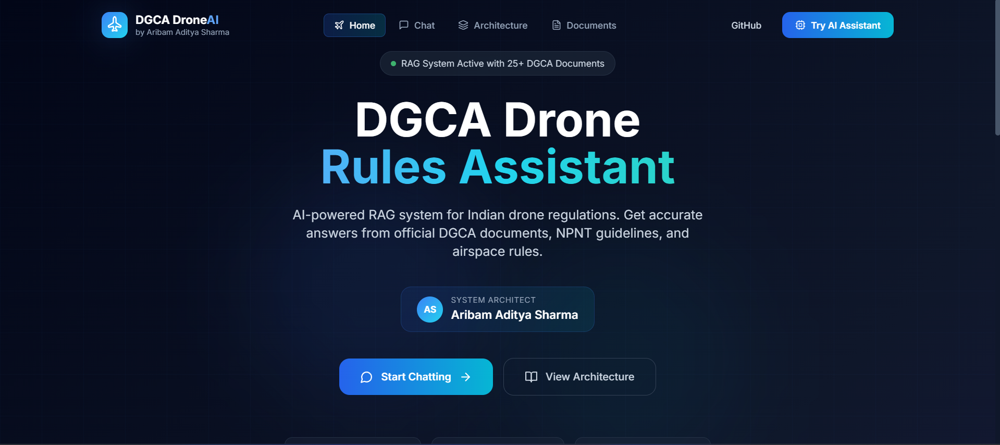
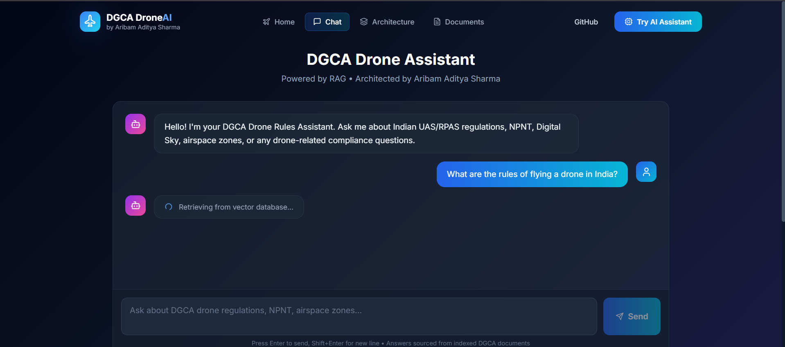
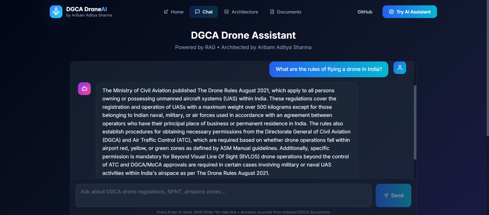
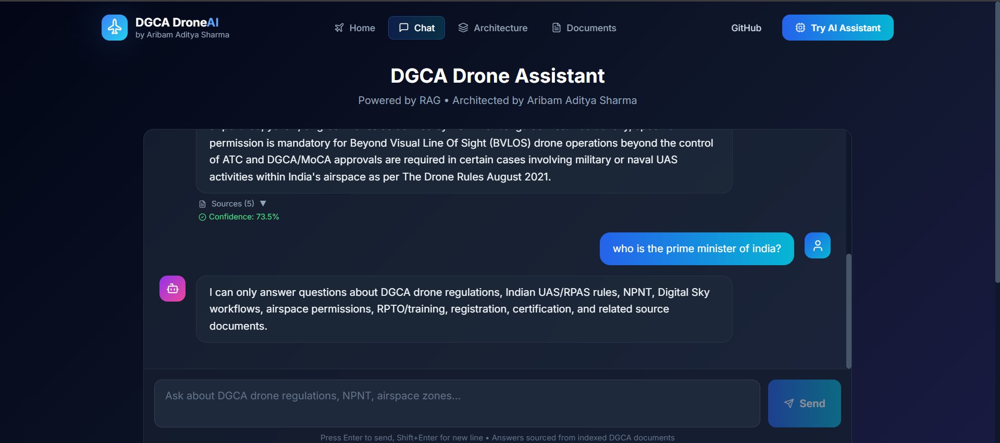

# DGCA Drone Rules Assistant

**AI-powered RAG (Retrieval-Augmented Generation) system for Indian DGCA drone regulations.**

> Built by **Aribam Aditya Sharma** - System Architect


## Screenshots

### Homepage


### Chat Interface - Loading State


### Chat Interface - AI Reply with Sources


### Domain Restriction Guardrail


## Overview

A production-ready RAG system that answers questions about DGCA drone regulations using:
- **25+ official DGCA documents** (PDFs)
- **Semantic search** via FAISS vector database
- **Local LLM** (Ollama - Phi3/Mistral) for privacy and cost-effectiveness
- **Modern React UI** with real-time chat interface

## Architecture

```
┌─────────────────┐     ┌─────────────────┐     ┌─────────────────┐
│   React UI      │────▶│   FastAPI       │────▶│   FAISS         │
│   (Frontend)    │     │   (Backend)     │     │   (Vector DB)   │
└─────────────────┘     └─────────────────┘     └─────────────────┘
                              │
                              ▼
                        ┌─────────────────┐
                        │   Ollama LLM    │
                        │   (Local AI)    │
                        └─────────────────┘
```

### RAG Pipeline

1. **Document Ingestion** - PDFs loaded via PyPDF
2. **Text Chunking** - 700-char chunks with 100-char overlap
3. **Embedding** - `all-MiniLM-L6-v2` (384D vectors)
4. **Vector Storage** - FAISS IndexFlatIP
5. **Retrieval** - Semantic search (top-5, min score 0.25)
6. **Guardrails** - Domain validation & query sanitization
7. **Generation** - Local LLM with grounded prompts

## Features

- Chat interface with source citations
- Confidence scores for answers
- Domain validation (drone/UAS/NPNT terms only)
- Document source tracking (page numbers)
- Real-time indexing endpoint
- Responsive dark-themed UI
- 100% local processing (no API keys needed)

## Quick Start

### Prerequisites

- Python 3.11+
- Node.js 18+
- Ollama (local LLM server)

### 1. Clone & Setup Backend

```bash
# Create virtual environment
python -m venv .venv
source .venv/bin/activate  # Linux/Mac
# or: .venv\Scripts\activate  # Windows

# Install dependencies
pip install -r requirements.txt

# Download embedding model (first run)
python -c "from src.embedder import get_embedding_model; get_embedding_model()"

# Index documents (creates FAISS database)
python -c "from src.vectordb import index_raw_documents; print(index_raw_documents())"
```

### 2. Start Ollama

```bash
# Install Ollama from https://ollama.ai
ollama run phi3:mini
# or: ollama run mistral
```

### 3. Start Backend

```bash
uvicorn src.api:app --reload --host 0.0.0.0 --port 8000
```

### 4. Setup Frontend

```bash
cd frontend
npm install
npm run dev
```

### 5. Open in Browser

- Frontend: http://localhost:5173
- Backend API: http://localhost:8000
- API Docs: http://localhost:8000/docs

## Document Library

Indexed documents include:
- Advisory Circulars (AC-101-1, AC-102-1, etc.)
- ANSS Air Navigation Safety Standards
- RPTO guidelines and syllabi
- Drone Manufacturing Circulars
- Public Notices
- Class 3 Medical Procedures
- Model UAS Regulations
- ASM Manual

Total: **25+ official DGCA documents**

## API Endpoints

| Endpoint | Method | Description |
|----------|--------|-------------|
| `/` | GET | Serve frontend |
| `/chat` | POST | Query the RAG system |
| `/index` | POST | Re-index documents |
| `/docs` | GET | OpenAPI documentation |

### Chat Request

```json
POST /chat
{
  "query": "What is NPNT?"
}
```

### Chat Response

```json
{
  "answer": "NPNT stands for No Permission – No Takeoff...",
  "sources": [
    {"source": "AC-102-37.pdf", "page": 5, "chunk": 3}
  ],
  "confidence": 0.85
}
```

## Configuration

Edit `.env` file:

```env
OLLAMA_BASE_URL=http://localhost:11434
LLM_MODEL=phi3:mini
EMBEDDING_MODEL=sentence-transformers/all-MiniLM-L6-v2
TOP_K=5
MIN_RETRIEVAL_SCORE=0.25
```

## Project Structure

```
DGCA-Airspace-Rules-Assistant/
├── src/                    # Python backend
│   ├── api.py             # FastAPI endpoints
│   ├── retriever.py       # Vector search
│   ├── vectordb.py        # FAISS operations
│   ├── embedder.py        # Sentence transformers
│   ├── guardrails.py      # Safety filters
│   ├── loader.py          # PDF ingestion
│   ├── splitter.py        # Text chunking
│   └── settings.py        # Configuration
├── frontend/              # React UI
│   ├── src/components/    # React components
│   ├── package.json
│   └── vite.config.js
├── data/raw/              # Source PDFs (25+)
├── db/                    # FAISS index & metadata
├── web/                   # Static files
├── requirements.txt
└── .env
```

## System Architect

**Aribam Aditya Sharma**

This RAG system was designed and architected by Aribam Aditya Sharma, featuring:
- Complete local LLM pipeline
- Production-grade guardrails
- Scalable vector search
- Modern responsive UI

## Tech Stack

| Layer | Technologies |
|-------|-------------|
| Backend | FastAPI, Python 3.11, Uvicorn |
| AI/ML | LangChain, Ollama, Phi3/Mistral |
| Embeddings | sentence-transformers, all-MiniLM-L6-v2 |
| Vector DB | FAISS, NumPy |
| Documents | PyPDF, PDFMiner, Unstructured |
| Frontend | React 18, Vite, TailwindCSS, Framer Motion |


## License

MIT License - See LICENSE file

## Acknowledgments

- DGCA (Directorate General of Civil Aviation) for official documents
- Ollama team for local LLM infrastructure
- LangChain community for RAG tooling
